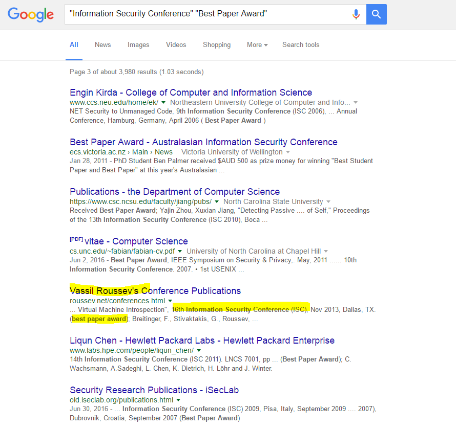

A what? - 75
======

Category: Trivia
------
Problem Statement:
This Information Security Conference 'Best Paper Award' winner once purchased a floppy disk. It was so expensive, he had to request funding. How much did that floppy disk cost?

------

Writeup
------

First we google the string we are given (`Information Security Conference Best Paper Award`). In order to avoid false positives, I added quotes around each of the key phrases:

After looking through 3 pages of people, we find this person: `Vassil Roussev`. Googling him, we get:

.png)

And we find our flag!

Flag: `$600`
