Isengard - 500
======

Category: Memory Forensics & Malware Analysis
------
Problem Statement:

Far over the CISC-y instruction mold<br>
To freezers deep and arches old<br>
We must avoid the ere break 0day<br>
To seek the lost flag behind the fold.

https://s3.amazonaws.com/hsf2016/isengard

Challenge by unlisted

------

Writeup
------
Note: To solve this problem, I used `gdb-peda`. You might want to download it from https://github.com/longld/peda. I also did everything on https://c9.io, a free cloud development environment.

One of the first things I always do when reversing, even before running the program itself, is running `strings` on it. This prints out strings of printable characters, and can often help in reversing a problem - or even get you the flag, if you're lucky:

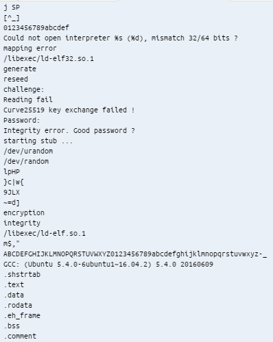

Well, we don't find any flags, but we do find an interesting string referring to Curve25519: `Curve25519 key exchange failed !` This caught my attention, especially the space between the `failed` and the `!`, so I decided to google this exact string.

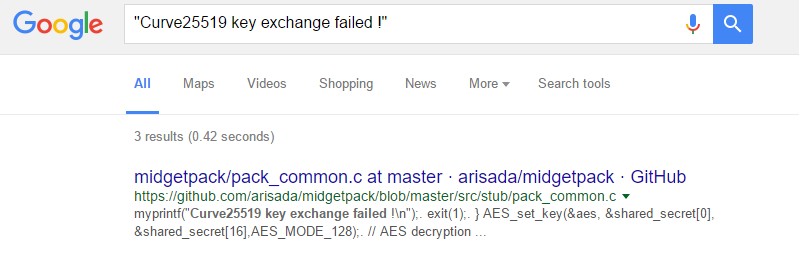

Looks like this program has been packed with [midgetpack](https://github.com/arisada/midgetpack)! Well, that doesn't help us much right now, so let's try another means of attack.

This time, let's try running the binary. Upon opening it, we are faced with a screen like this:

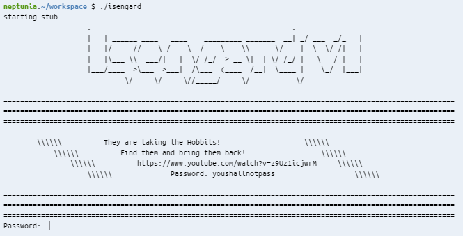

(By the way, for those curious, the YouTube link isn't relevant to the problem - it's just a 10 hour [video](https://youtube.com/watch?v=z9Uz1icjwrM) called "Taking the Hobbits to Isengard.")

After putting in the password (`youshallnotpass`), the program seems to hang. But let's try putting in some text:

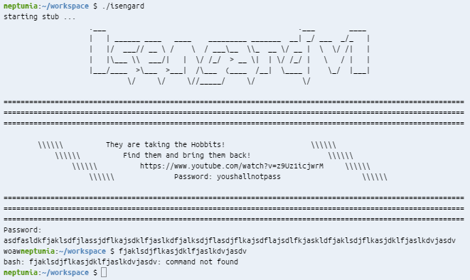

Looks like its taking input, and after it's taken a certain amount of characters it'll print `woaw`. We plug it into `gdb` to maybe see what's going on (`gdb ./isengard`).

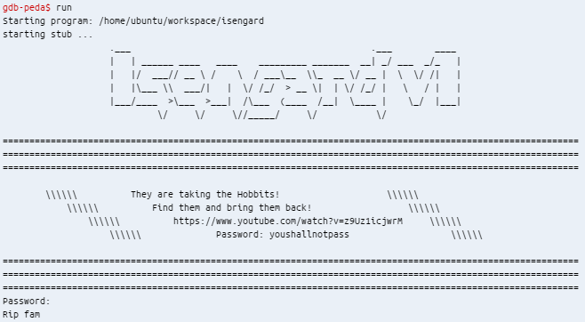

It seems like the program knows it's being run in gdb, and prints out `rip fam` to console us with our failure. Let's try running `strace` on it to maybe get a better idea of what it's doing.

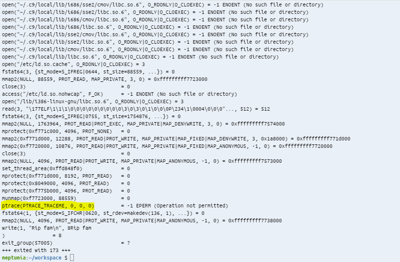

The highlighted line shows that the program is calling `ptrace`. After googling around, I found [this site](http://manoharvanga.com/hackme/) that poses a similar problem. `ptrace` is often used in programs to tell if it is being run within a debugger (like `gdb`), since it returns -1 if the environment it is running in is already ptraced. The site also presents a remedy: make a fake `ptrace` function, and load it into the binary via `LD_PRELOAD`. I used this fake ptrace function (saved as `fake.c`):

```c
#include <stdio.h>

long ptrace(int x, int y, int z)
{
	printf("B-)\n");
	return 0;
}
```

and compiled it with:
 `gcc -m32 -shared -fPIC -o fake.so fake.c`
 
 (NOTE: in order to do this on a 64-bit OS, you'll need gcc-multilib. Install it with `sudo apt-get install gcc-multilib`.)

Now, when I run isengard in a ptraced environment with this LD_PRELOAD environment variable set, I get:

```bash
neptunia:~/workspace $ strace -E LD_PRELOAD=./fake.so ./isengard 
... snip ... (enter password here)
open("./fake.so", O_RDONLY|O_CLOEXEC)   = 3
... snip ...
write(1, "B-)\n", 4B-)
```

When we reach the point where the program used to say `rip fam`, instead it shows `B-)` (courtesy of our fake ptrace function), and it asks for our input. After inputting our string, we get:

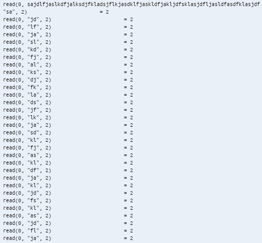

Looks like it reads our input 2 characters at a time. This will be important later. Running it in GDB, we get similar results:

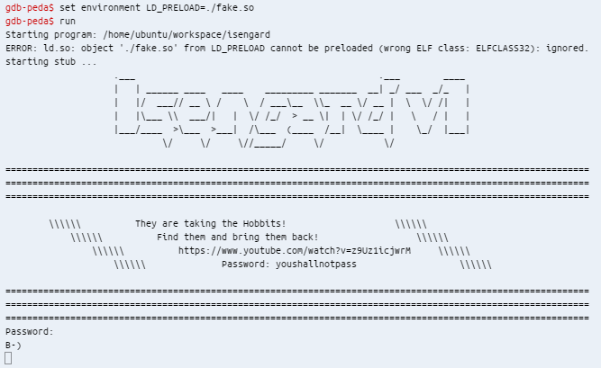

So that we don't have to type it in every time we run gdb, we can do this in bash:
`echo set environment LD_PRELOAD=./fake.so >> ~/.gdbinit`
This will make it so that the LD_PRELOAD environment variable will be set automatically every time we run gdb. 

<h4>Now it's time for the real reversing!</h4>

We want to find out some information about the real program, not that packer standing in our way, or any syscalls like `read()`.  So, we run the program in gdb, type in the password, and when it asks for input we hit `Ctrl+C` to break. We then hit n, input 2 characters, and keep hitting n until we reach an address that isn't in the `0xf7xxxxxx` range:

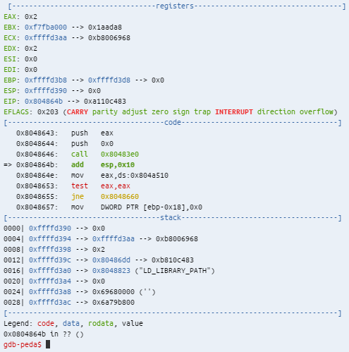

Ok, so it looks like we're in the right place. I wasn't too familiar with how packers worked, but I figured that they had to load most of the program unpacked into memory somewhere, so I tried dumping as much of the memory in this range as possible. After being guided with some error messages about memory being unreadable, I ended up dumping memory with this command:

```bash
gdb-peda$ dump binary memory out 0x08047000 0x08100000
Cannot access memory at address 0x8047000
gdb-peda$ dump binary memory out 0x08048000 0x08100000
Cannot access memory at address 0x804b000
gdb-peda$ dump binary memory out 0x08048000 0x0804b000
```

Let's take a look at that. Even though we can't run it (because it's not a real executable), we can check it for `strings`:

```
neptunia:~/workspace $ strings ./out
... snip ...
Rip fam
LD_PRELOAD
LD_LIBRARY_PATH
woaw
great
... snip ...
```
Now, based on what we've seen from the program, we can guess that what it's doing is taking user input, comparing it to some flag, and if it matches, it'll print out `great`. Otherwise, it'll print out `woaw`. So, let's find out the address where it exits all the loops, and begins the checking with the flag. In order to do this, though, we'll first need to figure out how many characters the input takes. After some guessing and checking, we find that it takes 74 characters of input. So, we can type 72 characters in, hit enter, and when it asks for more input, we hit `Ctrl+C`. This will allow us to step through the instructions without having to go through the loop multiple times.

Through careful inspection of every `jmp`, `jne`, `ret` and other jump-related instruction, while hitting `n` (next instruction), I found an address during the flag checking: `0x804873e` (This was tedious, but not hard. When you start seeing `cmp`s with weird values, you know you're in the general vicinity. It's not a precise art; you just want to find a point before the program ends). I set a breakpoint here. I then step through to take a look at how the program checks for flags:

```assembly
   0x8048732:   mov    eax,DWORD PTR [ebp-0x10]
   0x8048735:   mov    eax,DWORD PTR [eax*4+0x804a460]
   0x804873c:   cmp    edx,eax
=> 0x804873e:   jne    0x8048747
 | 0x8048740:   mov    eax,0x1
 | 0x8048745:   jmp    0x804874c
 | 0x8048747:   mov    eax,0x0
 | 0x804874c:   mov    DWORD PTR [ebp-0xc],eax
 |->   0x8048747:       mov    eax,0x0
       0x804874c:       mov    DWORD PTR [ebp-0xc],eax
       0x804874f:       add    DWORD PTR [ebp-0x10],0x1
       0x8048753:       mov    eax,DWORD PTR [ebp-0x10]
```


After continuing for a bit and jumping to `0x8048722`, it looks like the program is comparing 2 values, stored beginning at `0x804a520` and `0x804a460`. 

```assembly
   0x8048728:   mov    eax,DWORD PTR [ebp-0x10]
   0x804872b:   mov    edx,DWORD PTR [eax*4+0x804a520]
   0x8048732:   mov    eax,DWORD PTR [ebp-0x10]
   0x8048735:   mov    eax,DWORD PTR [eax*4+0x804a460]
   0x804873c:   cmp    edx,eax
```

Let's take a look at what's stored in each of those, with `x/h` (examine memory at the given location, in hex):

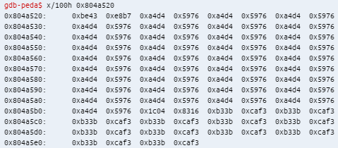

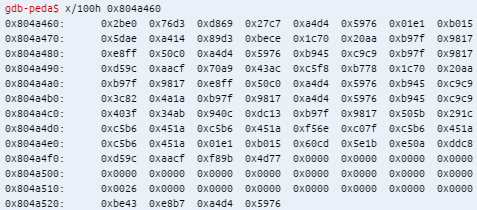

(the string I entered was `aaaaa...` (74 a's))

Looks like the value stored at `0x804a460` is the encrypted flag, and the value at `0x804a520` is an encrypted version of what I entered! It also seems that `0xa4d4 0x5976` translates to the letter `a`, and this value occurs multiple times in the suspected flag value. It looks like we're onto something!

Now we have a clear plan of attack:

1. Run the program (in gdb). Make sure you `delete` all breakpoints beforehand.
2. Enter "youshallnotpass" when prompted for the password
3. Hit Ctrl+C so that we can add a breakpoint.
4. `break * 0x804873e`. This will allow us to immediately stop the program once we get to the flag check part. Note: we have to do this here, after the program has been unpacked, or else we'll get an error saying that GDB couldn't place a breakpoint there.
5. `continue`
6. Enter a string, comprised of various letters.
7. The program will stop at the breakpoint. Do `x/100h 0x804a520`. 
8. Figure out what letters translate to what encrypted hex values, and check the flag value (which is static) for those letters.
9. Repeat until flag is decrypted.

The first string I used was:
`aaaabbbbccccddddeeeeffffgggghhhhiiiijjjjkkkkllllmmmmnnnnooooppppqqqqrrrrss`

Which gave out:

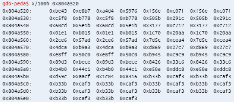

From this, we see that:
```
a = 0xa4d4 0x5976
b = 0xf56e 0xc70f
c = 0x60cd 0x5e1b
...
q = 0xb4b0 0x44c1
r = 0xe50a 0xddc8
```

And our current version of the flag looks like:

```
0x804a460:      0x2be0  0x76d3  l               a               g             
0x804a470:      0x5dae  0xa414  o               h               0xb97f  0x9817
0x804a480:      m               a               n               0xb97f  0x9817
0x804a490:      0xd59c  0xaacf  0x70a9  0x43ac  c               h             
0x804a4a0:      0xb97f  0x9817  m               a               n             
0x804a4b0:      0x3c82  0x4a1a  0xb97f  0x9817  a               n             
0x804a4c0:      0x403f  0x34ab  0x940c  0xdc13  0xb97f  0x9817  d             
0x804a4d0:      0xc5b6  0x451a  0xc5b6  0x451a  b               0xc5b6  0x451a
0x804a4e0:      0xc5b6  0x451a  g               e               r             
0x804a4f0:      s               0xf89b  0x4d77  0x0000  0x0000  0x0000  0x0000
```

We're making progress! Let's restart the program, and this time we enter as input:
`ssssttttuuuuvvvvwwwwxxxxyyyyzzzz1111222233334444555566667777888899990000__`

Which gives:

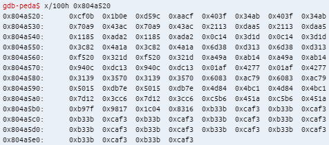

So now our flag is:
```
0x804a460:      0x2be0  0x76d3  l               a               g             
0x804a470:      0x5dae  0xa414  o               h               _             
0x804a480:      m               a               n               _             
0x804a490:      s               u               c               h             
0x804a4a0:      _               m               a               n             
0x804a4b0:      y               _               a               n             
0x804a4c0:      t               3               _               d             
0x804a4d0:      0               0               b               0             
0x804a4e0:      0               g               e               r             
0x804a4f0:      s               0xf89b  0x4d77  0x0000  0x0000  0x0000  0x0000
```
At this point, we have enough to infer that the first character is `f`, `0x5dae  0xa414` is `{`, and `0xf89b  0x4d77` is `}`. That would make the flag `flag{oh_man_such_many_ant3_d00b00gers}`, which indeed is correct.

Flag: `flag{oh_man_such_many_ant3_d00b00gers}`
