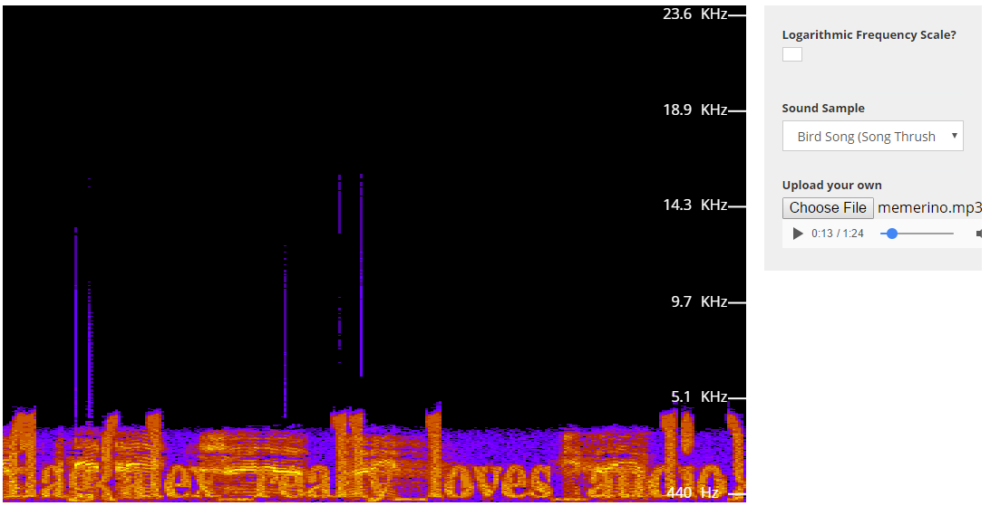

Music Majors Can Hack Too - 300
======

Category: Steganography & Image Forensics
------
Problem Statement:
Shortwave numbers stations are really, really creepy.

https://s3.amazonaws.com/hsf2016/Music+Majors+Can+Hack+Too.mp4

Challenge by Alex Vanderpot and Gus Naughton

------

Writeup
------

In this challenge, we are given a mp4 file. Playing it, it sounds really strange. Oftentimes, when a file has strange sounds, it is a [spectrogram](https://en.wikipedia.org/wiki/Spectrogram). We first convert it to a mp3 (any online or offline tool will work. I used VLC, but you could use http://media.io/ or the like).

Now that we have a mp3 containing just the audio, we wish to view the spectrogram. I used https://academo.org/demos/spectrum-analyzer/. Uploading our new mp3 file, and hitting play, we can see the flag show up at the bottom!

Flag: `flag{alex_really_loves_audio}`
