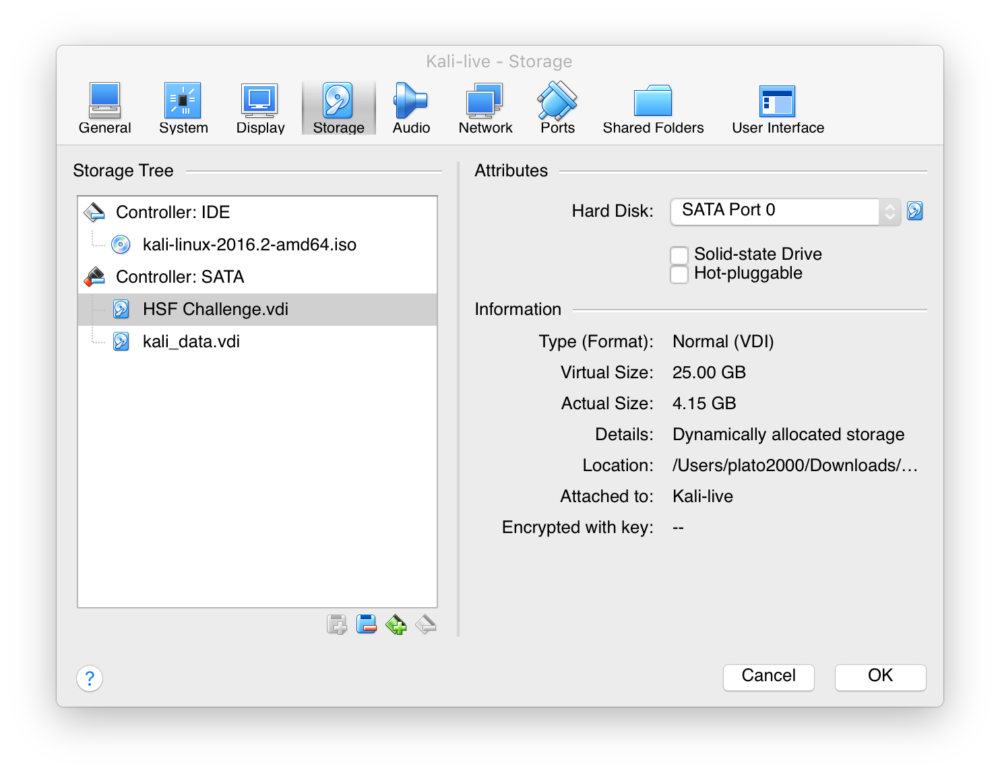
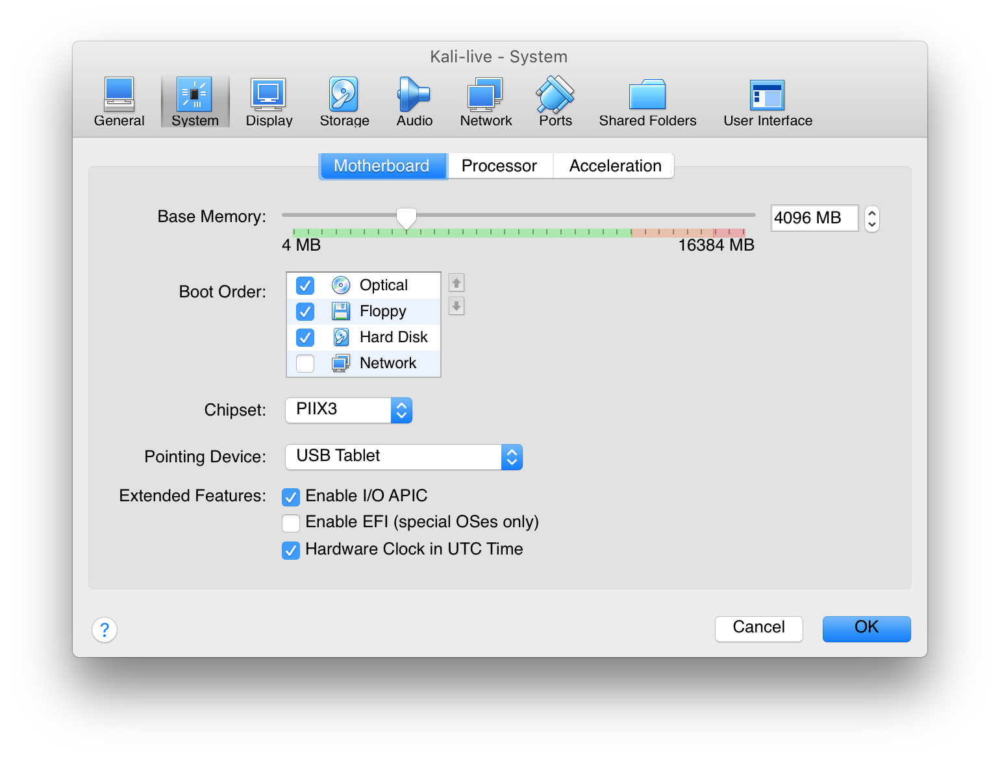
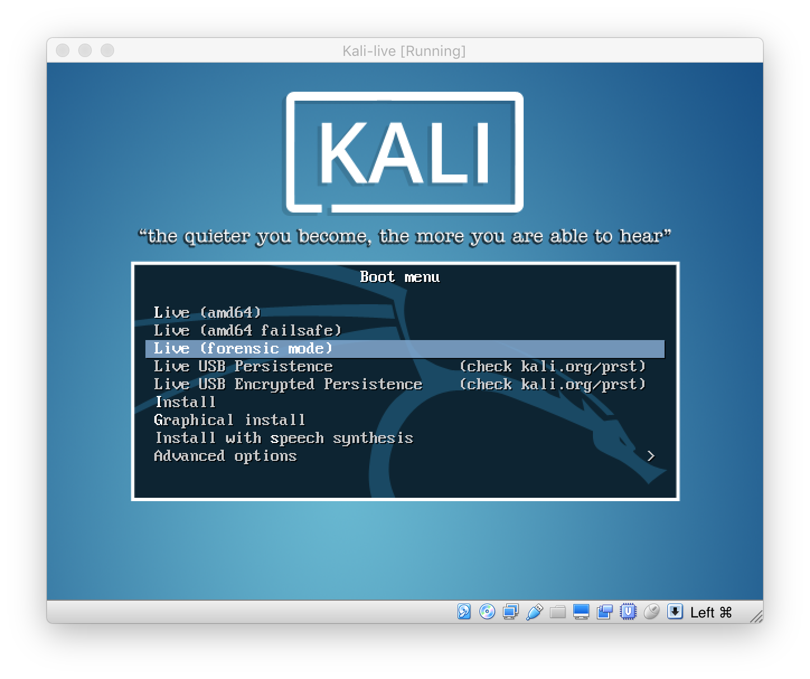
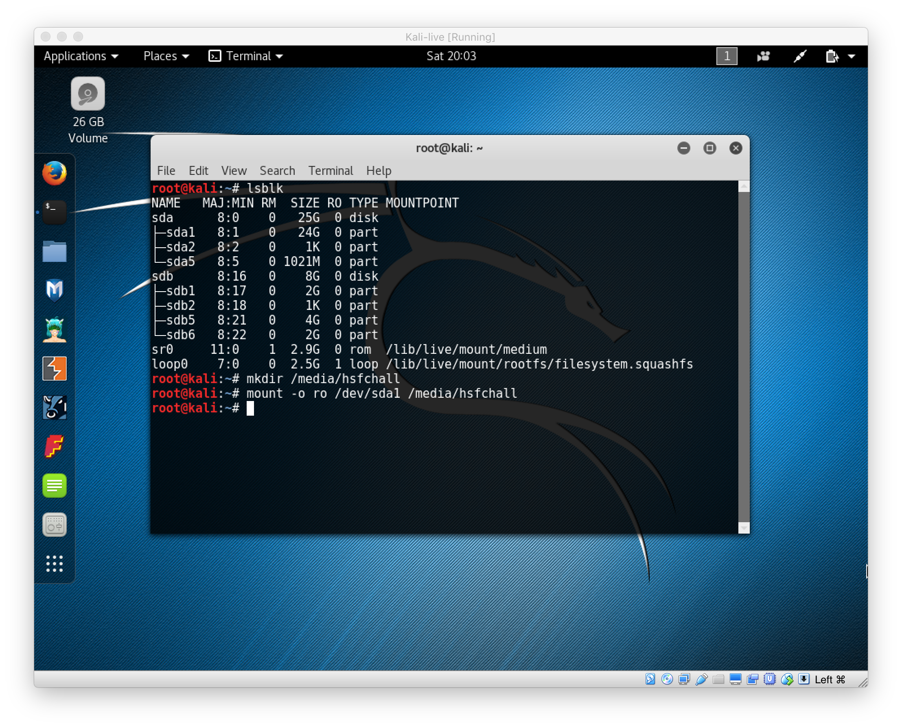
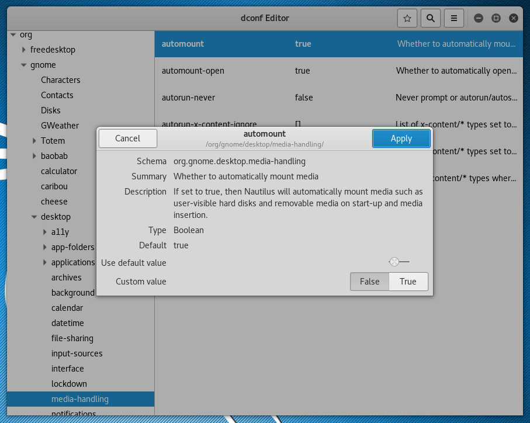
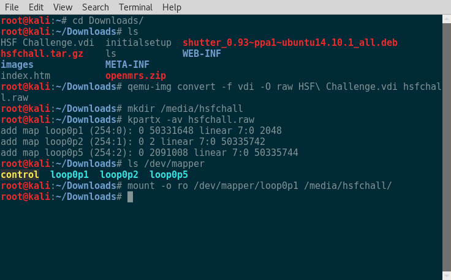
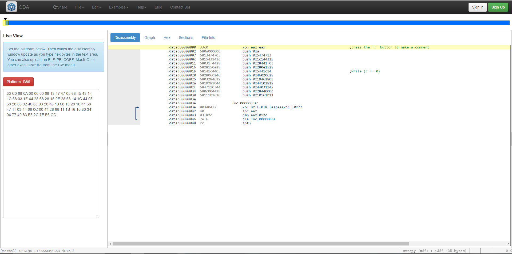

Napolean's (Seer)Sucky Intern - 400
======

Category: File & Disk Forensics
------
Problem Statement:
We (an unnamed hospital) hired an intern that we thought would be great because he won some high school hacker challenge. 
Turns out he was terrible, came on, downloaded some random open source EMR stuff, then went on vacation to Charleston. 
Now that he's gone, we've noticed all kinds of weird traffic coming from his machine, but no real evidence that he did much with it. Can you help us figure out what's going on? 

Here's a copy of his disk: https://s3.amazonaws.com/hsf2016/hsfchall.tar.gz

Thanks, 
Leo

Challenge by Justin Paglierani

------

Writeup
------

First, we download the file given to us in the link. It's a `.tar.gz `, so we can decompresss it with `tar -xvzf hsfchall.tar.gz`. In the archive, we find a file called `HSF Challenge.vdi`. This is a Virtual Disk Image, so we want to mount it to look through the files - but we want to make sure we don't accidentally write to the disk image and potentially damage the evidence. This is obviously important to make sure we don't accidentally delete incriminating information. In real criminal cyber forensics, though, we have to do this to make sure that the accused party can't just claim that we've tampered with the evidence to get incriminating information.

There are a few good ways to do this. First, one could use Kali Linux's forensics mode, which can be accessed using the Kali live CD. If you choose this method, you can use VirtualBox or whatever VM-running software you use and attach the VDI file we have to a machine that has the Kali live CD on it:



Then, you have to make sure that the live CD is first in the boot order:



After you do this, make sure that you boot into Forensics Mode:



Finally, you can just mount the disk, using the `ro` option to mount it as read-only: 

```
mkdir /media/hsfchall
mount -o ro /dev/sda1 /media/hsfchall
```



------

The second option, if you'd rather do the process without using a live CD VM, is to do the whole process in a Kali Linux VM (or, in fact, any other VM (no live CD, just a regular install). This is the option I chose, since I wanted to be able to store files on disk and install tools permanently. In this case, we download the file in our VM, decompress it there, and then follow a similar process.

However, before we do that, we want to make sure we don't have automount enabled. This means that when a storage device or a virtual storage device is connected to our VM, we want to make sure it doesn't automatically mount and write to the device. To do this, we can change the settings on our machine to not automount.

To do this on a Kali install, we simply open dconf editor and go to `org.gnome.desktop.media-handling` and change `automount` to false:


Then, we can proceed with the converting and mounting process. We can do this with:

```bash
qemu-img convert -f vdi -O raw HSF\ Challenge.vdi hsfchall.raw
sudo mkdir /media/hsfchall
sudo kpartx -av hsfchall.raw
sudo mount -o ro /dev/mapper/loop0p1 /media/hsfchall
```

This should look like this:



In the first command, we're converting the VDI file given to us into a raw disk image (if you haven't used `qemu` before, you need to install it with `sudo apt-get install qemu`). Then, we create a directory to mount that disk image to. Then, we create mappings for each partition in the raw disk image with `kpartx` (if you don't have this, install it with `sudo apt-get install kpartx`. Finally, we mount it. We know which partition to mount because the data partition is the largest. We use `ro` in the mount command to do a read-only mount.

------

Both options end up resulting in accessing the same data.

Once we have the device mounted, we can look at the files in there. The first thing we look at is the `/home` folder. We see that the user's home folder is `johnny`. In here, we see that there is a file called `openmrs.war` and a `demo-1.12.0.sql` file as well. These look suspicious, so we look inside the `.war` file to find `index.htm`. Here, we see that the version of OpenMRS that the WAR file pertains to is 2.0.0.889ccc. On the OpenMRS website, we see that it's open source EMR software, like what the problem statement said the intern downloaded. If we download the actual `openmrs.war` file for that version and build number from the OpenMRS website, and we run a `diff` between the two files, we get no differences. If we do the same for the `demo-1.12.0.sql` file, also from the OpenMRS website, we also find that these two files have not been changed since they were downloaded from the OpenMRS website.

It seems, then, that this is probably not what we're looking for. If we keep looking through Johnny's home directory, we see that the `.bash_history` has some interesting content in it:
```bash
ls -version
ls --help
ls --version
ls --version -vvvvvvvv
ls
ls -la
ls --help
man s
man ls
ls
su 
su
ls
cat .bash_history
vim ls
ed ls
wget google.com
ugh this place is the worst
exit
ls
cat .bash_history
nano ls
nano .bash_history 
exit
```
It seems that Johnny tried to use `ls` with a bunch of random `v` flags attached to the end. Also, he tried looking at the man page. Then, he used `su` to elevate himself to superuser (root). Finally, it seems that he tried to mess with the `.bash_history` file. There is no backup of that file in the home directory, so we continue looking for stuff in root's home directory. 

Since Johnny used `su`, whatever commands he used while superusered will be in the `/root/.bash_history` file. When we look there, we see this:
```bash
ls
apt-get update
nano /etc/apt/sources.list
apt-cache search box
apt-cache search virtual
apt-cache search virtualbox
exit
ifconfig
ifconfig
ifconfig
ifconfig
ifconfig
ifconfig
ifconfig
ifconfig
ifconfig
ifconfig
ifconfig
ifconfig
ls
ls -la
ls -la
exit
ls
ls -la
cat .bash_history 
rm .bash_history
ls -la
cd /bin
ls
hexdump su
exit
cat .bash_history
cat /root/.bash_history 
ls
ls -la
exit
```

Here, we can see that he used `ifconfig` a lot. We also see, however, that he removed the `.bash_history` file. This means that everything he did before the last `su` session was deleted. This is unfortunate, but one pretty suspicious thing in this session that we see is that he went into the `/bin` directory.

Since we still don't know much about what he was doing, we move on again. Since now we've looked through a few of the obvious places to look for tampering, and we have only a few hints, we try something else - sort all files in the filesystem by their last modified date. This is not a fully reliable method, because hackers with experience can mess with the metadata on files specifically to make sure that the last modified date on what they did is not suspiciously different from what it should be. However, it is an effective method to catch the inexperienced hacker or just someone who was rushed.

To sort by last modified with a simple command, we find this Stack Overflow [link](http://superuser.com/a/546900). However, since we want to run this on the whole filesystem, it will provide a lot of output. So, we change the command in the Stack Overflow answer to `find /media/hsfchall -printf "%T@ %Tc %p\n" | sort -r > ~/lastmodified.txt`. Instead of sorting first modified to last modified, we reverse that so the last modified file will be on the top. Then, we output everything to a file on our home directory. We look at the top of this file to find some interesting things:
```
2016-08-07 15:13:17.5137598080 /media/hsfchall/home/johnny/.config/dconf/user.4WDKLY
2016-08-07 15:13:17.5097598080 /media/hsfchall/home/johnny/.config/dconf/user
2016-08-07 15:13:15.4217597770 /media/hsfchall/var/log/user.log
2016-08-07 15:13:15.4217597770 /media/hsfchall/var/log/syslog
2016-08-07 15:13:15.4217597770 /media/hsfchall/var/log/messages
2016-08-07 15:13:15.2177597740 /media/hsfchall/home/johnny/.local/share/recently-used.xbel
2016-08-07 15:13:15.2097597740 /media/hsfchall/home/johnny/.config/gedit/accels
2016-08-07 15:13:15.1097597720 /media/hsfchall/home/johnny/.local/share/gvfs-metadata/home-d44325d0.log
2016-08-07 15:13:06.2697596430 /media/hsfchall/home/johnny/.local/share/zeitgeist/fts.index/record.baseB
2016-08-07 15:13:06.2617596430 /media/hsfchall/home/johnny/.local/share/zeitgeist/fts.index/termlist.baseB
2016-08-07 15:13:06.2617596430 /media/hsfchall/home/johnny/.local/share/zeitgeist/fts.index/position.baseA
2016-08-07 15:13:06.2537596430 /media/hsfchall/home/johnny/.local/share/zeitgeist/fts.index/termlist.DB
2016-08-07 15:13:06.2537596430 /media/hsfchall/home/johnny/.local/share/zeitgeist/fts.index/record.DB
2016-08-07 15:13:06.2537596430 /media/hsfchall/home/johnny/.local/share/zeitgeist/fts.index/postlist.DB
2016-08-07 15:13:06.2537596430 /media/hsfchall/home/johnny/.local/share/zeitgeist/fts.index/postlist.baseB
2016-08-07 15:13:06.2537596430 /media/hsfchall/home/johnny/.local/share/zeitgeist/fts.index/position.DB
2016-08-07 15:13:06.2297596430 /media/hsfchall/home/johnny/.local/share/zeitgeist/activity.sqlite
2016-08-07 15:13:06.2257596430 /media/hsfchall/home/johnny/.local/share/zeitgeist/activity.sqlite-wal
2016-08-07 15:13:06.2217596430 /media/hsfchall/home/johnny/.local/share/zeitgeist/activity.sqlite-shm
2016-08-07 15:13:05.6497596340 /media/hsfchall/home/johnny/.local/share/gvfs-metadata/root-7811bac0.log
2016-08-07 15:13:05.6417596340 /media/hsfchall/home/johnny/.local/share/gvfs-metadata/root
2016-08-07 15:12:55.4977594860 /media/hsfchall/var/log/daemon.log
2016-08-07 15:12:50.9297594190 /media/hsfchall/var/log/wtmp
2016-08-07 15:12:50.9297594190 /media/hsfchall/home/johnny/.bash_history
2016-08-07 15:12:15.7697589050 /media/hsfchall/var/lib/NetworkManager/dhclient-3b686bda-30fc-4b06-8f0e-678fd4f139c3-eth0.lease
2016-08-07 15:12:06.1697587640 /media/hsfchall/home/johnny/.cache/tracker/meta.db-shm
2016-08-07 15:12:05.7017587580 /media/hsfchall/home/johnny/.local/share/tracker/data/tracker-store.journal
2016-08-07 15:12:05.7017587580 /media/hsfchall/home/johnny/.cache/tracker/meta.db-wal
2016-08-07 15:12:00.5737586830 /media/hsfchall/home/johnny/.local/share/zeitgeist/fts.index/termlist.baseA
2016-08-07 15:12:00.5737586830 /media/hsfchall/home/johnny/.local/share/zeitgeist/fts.index/record.baseA
2016-08-07 15:12:00.5697586830 /media/hsfchall/home/johnny/.local/share/zeitgeist/fts.index/position.baseB
2016-08-07 15:12:00.5617586820 /media/hsfchall/home/johnny/.local/share/zeitgeist/fts.index/postlist.baseA
2016-08-07 15:11:29.0697582220 /media/hsfchall/var/log/auth.log
2016-08-07 15:11:29.0697582220 /media/hsfchall/root/.bash_history
2016-08-07 15:08:18.3657554330 /media/hsfchall/bin/ls
```

Most of these files seem to be files modified by background processes. But, we see that Johnny modified his and root's `.bash_history`. This is when he ended his shell session, which wrote what we see in those files now. However, we see something very interesting right before the root's `.bash_history` is modified - `/bin/ls` has been modified. This is very interesting, since the `ls` binary has no reason to be any different from what it was at install. Besides this, we saw earlier that Johnny tried running `ls` many times with the v flags at the end, and he also went into the `/bin` directory as root. The combination of these three things means that we should probably look into what exactly was changed in the `ls` binary. 

To do this, first, we have to see what the original binary was. If we run `file /media/hsfchall/bin/ls`, we get:
```
ls: ELF 32-bit LSB executable, Intel 80386, version 1 (SYSV), dynamically linked, interpreter /lib/ld-linux.so.2, for GNU/Linux 2.6.32, BuildID[sha1]=152184668fe2d58ef2ef49e8c40d044880f8e318, stripped
```

We can see that the binary is 32 bit, so we should compare it to another 32 bit `ls` binary. To be sure that we get the exact same file that this machine started with, though, we should use the `ls` binary from the exact version of the OS this computer was running. This ensures that there is no different compiler and no different compiler flags causing possible differences in the binaries. 

With a simple Google search, we see that the Linux distro and version are stored in `/etc/issue`. Looking at this file, we see that the computer ran Debian 8. To get the `ls` binary for this distro and version, we install Debian 8 on a virtual machine and extract the `/bin/ls` that is in that machine. Now, we compare the two binaries we have with `diff <(xxd /hsfchall/bin/ls) <(xxd ~/Downloads/ls)`. This uses the hex viewer `xxd` and compares the output from the two files. When we do this, we get:
```
7303,7308c7303,7308
< 0001c860: 2067 0a0e 0841 c30e 0441 0b00 33c0 680a   g...A...A..3.h.
< 0001c870: 0000 0068 1347 4705 6815 4314 1c68 031f  ...h.GG.h.C..h..
< 0001c880: 4428 6828 150e 2868 141c 4405 6828 0602  D(h(..(h..D.h(..
< 0001c890: 4668 0328 4619 6819 2810 4468 4711 0344  Fh.(F.h.(.DhG..D
< 0001c8a0: 680c 0044 2868 111b 1610 8034 0477 4083  h..D(h.....4.w@.
< 0001c8b0: f82c 7ef6 cc00 0000 0000 0000 0000 0000  .,~.............
---
> 0001c860: 2067 0a0e 0841 c30e 0441 0b00 0000 0000   g...A...A......
> 0001c870: 0000 0000 0000 0000 0000 0000 0000 0000  ................
> 0001c880: 0000 0000 0000 0000 0000 0000 0000 0000  ................
> 0001c890: 0000 0000 0000 0000 0000 0000 0000 0000  ................
> 0001c8a0: 0000 0000 0000 0000 0000 0000 0000 0000  ................
> 0001c8b0: 0000 0000 0000 0000 0000 0000 0000 0000  ................
```

The first one here is the modified `ls` and the second is the original. There are very few differences between the files. When looking at this hexdump, though, what we notice is that there are a lot of `68` bytes added in the modified file.

`0x68` seemed really familiar to me. Where had I seen it before? Since this was put into a binary, let's look at what instruction `0x68` means. According to [this site](http://ref.x86asm.net/coder32.html), `68` is the opcode for `PUSH`. That's very interesting for us, because it means that the program is pushing values onto the stack!

In order to figure out what the newly added code is doing, we can plug it in to the [online disassembler](https://onlinedisassembler.com/odaweb/) as hex data, which shows us the assembly code.



Using this, we see that the assembly pushes a number of bytes onto the stack, then loops through them and xors each byte with `0x77`.

I wrote a quick python script to translate it:

```python
s = '68 13 47 47 05 68 15 43 14 1C 68 03 1F 44 28 68 28 15 0E 28 68 14 1C 44 05 68 28 06 02 46 68 03 28 46 19 68 19 28 10 44 68 47 11 03 44 68 0C 00 44 28 68 11 1B 16 10'
b = s.replace('68','').strip()
print b
for i in b.split(' '):
    if i == '':
        continue
    print(chr(int(i,16)^0x77))
```

It prints a flag-like thing, but it's out of order! That's because each sequence of 4 bytes is grouped together (so they're in order correctly), but the stack itself got reversed. We can easily fix our script for that, though (or just piece together the flag manually):

```python
s = '68 13 47 47 05 68 15 43 14 1C 68 03 1F 44 28 68 28 15 0E 28 68 14 1C 44 05 68 28 06 02 46 68 03 28 46 19 68 19 28 10 44 68 47 11 03 44 68 0C 00 44 28 68 11 1B 16 10'
b = s.replace('68','').strip()
print b
z = 0
o = ''
output = []
for i in b.split(' '):
    if i == '':
        continue

    o += chr(int(i,16)^0x77)
    z += 1
    if z == 4: # make a little buffer for each 4 characters
        # once it's full, add it to final output
        print(o)
        output.append(o)
        z = 0 # and clear the buffer
        o = ''
    #print(chr(int(i,16)^0x77))
print(''.join(output[::-1])) # reverse the output
```

And it prints out our flag (albeit with the closing brace missing):
`flag{w3_0ft3n_g3t_1n_qu1ck3r_by_th3_b4ckd00r`

Flag: `flag{w3_0ft3n_g3t_1n_qu1ck3r_by_th3_b4ckd00r}`


